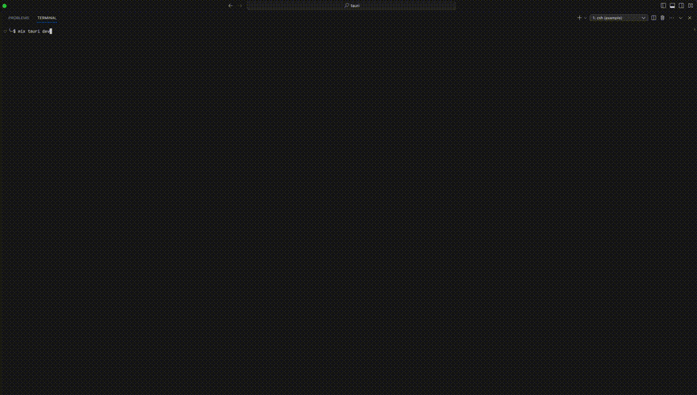

# Tauri
> Warning: Still a Proof of Concept with a lot of bad code
Wrapper around Tauri to enable the development of Phoenix Desktop applications



## Acknowledgements

* [Tauri App](tauri.app) for building it and providing a ton of support to find the right way to build the PoC
* [Digit / Doawoo](https://twitter.com/doawoo) for [Burrito](https://github.com/burrito-elixir/burrito) which enables us to build the binary to be used as a sidecar
* [Kevin Pan / Feng19](https://twitter.com/kevin52069370) for their example that heavily inspired the approach taken with their [phx_new_desktop](https://github.com/feng19/phx_new_desktop) repository
* [yos](https://twitter.com/r8code) for a [great discussion](https://twitter.com/r8code/status/1692573451767394313?s=20) and bringing Feng19 example into the mix (no pun intended)
* [Phoenix Framework Tailwind](https://github.com/phoenixframework/tailwind) which was a big inspiration on the approach to be taken when it came to install an outside package and use it within an Elixir project
## How it works

### Tauri.install

* Using Rusts cargo install, installs [Tauri](tauri.app) in your local dependencies
* Runs `tauri init` with the given configuration to create your `src-tauri` folder in your project root
* Overrides `Cargo.toml` since original [Tauri](tauri.app) depends on installation folders which made it trickier
* Moves `build.rs` into `src-tauri/src` due to an error during development
* Setups the required sidecars in `src-tauri/tauri.conf.json`

### Tauri.run

* Turns off `TAURI_SKIP_DEVSERVER_CHECK` which was blocking the [Tauri](tauri.app) code from running `main.rs`
* Checks if the project has a [Burrito](https://github.com/burrito-elixir/burrito) release configured
* Wraps the Phoenix application using [Burrito](https://github.com/burrito-elixir/burrito)
* Renames the output from [Burrito](https://github.com/burrito-elixir/burrito) to be compatible with Tauri's way of calling a sidecar
* Runs `tauri` and passes the arguments into [Tauri](tauri.app)

## Installation
### Requirements
* Zig (0.10.0)
* Rust

### Getting your application ready

For reference please check the [example](/example) folder in this repository

* Add dependency
```elixir
def deps do
  [
    {:tauri, path: "/Users/filipecabaco/workspace/tauri"}
  ]
end
```
* Add configuration
```elixir
config :tauri, version: "1.4.0", app_name: "Example Desktop", host: "localhost", port: 4000
```
* Add burrito release
```elixir
  def project do
    [
      app: :example_desktop,
      version: "0.1.0",
      elixir: "~> 1.14",
      elixirc_paths: elixirc_paths(Mix.env()),
      start_permanent: Mix.env() == :prod,
      aliases: aliases(),
      deps: deps(),
      releases: releases()
    ]
  end
  # ...
  defp releases do
    [
      desktop: [
        steps: [:assemble, &Burrito.wrap/1],
        burrito: [
          targets: [
            # At the moment we still need this really specific names
            "aarch64-apple-darwin": [os: :darwin, cpu: :aarch64]
           ]
        ]
      ]
    ]
  end
```
* Add `:inets` and other `extra_applications` you might need since burrito needs to be aware of them
```elixir
  def application do
    [
      mod: {ExampleDesktop.Application, []},
      extra_applications: [:logger, :runtime_tools, :inets]
    ]
  end
```
* Extra: Have a way to start up your repos during startup:
```elixir
defmodule ExampleDesktop.Starter do
  alias ExampleDesktop.Repo

  def run() do
    Application.ensure_all_started(:ecto_sql)

    Repo.__adapter__().storage_up(Repo.config())
    Ecto.Migrator.run(Repo, :up, all: true)
  end
end
```
* Check your runtime.exs, there's a lot of environment variables that you might need to build your server

* Setup tauri by running `mix tauri.install`

## Running
* Run tauri in development mode with `mix tauri dev`

* Build a distributable package with `mix tauri build`


